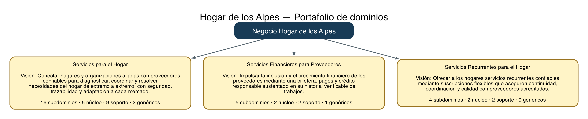
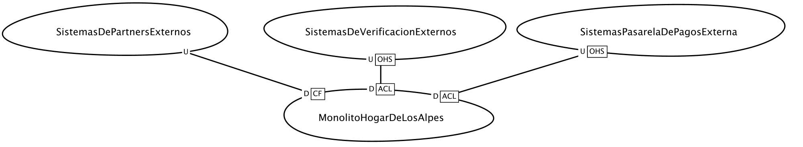
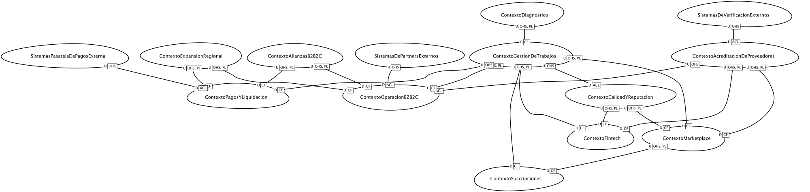

# Hogar de los Alpes — Entrega 1: Arquitectura de dominio

Este repositorio reúne los artefactos de diseño estratégico elaborados para el
caso **Hogar de los Alpes** en el curso **Construcción de aplicaciones no
monolíticas**. La documentación está dirigida a los equipos de ingeniería y
conecta tres perspectivas complementarias:

1. el portafolio de **dominios y subdominios** del negocio;
2. el **lenguaje ubicuo y los flujos TO-BE** mediante Event Storming; y
3. los **contextos acotados y sus relaciones** en las vistas AS-IS y TO-BE.

El objetivo es conservar trazabilidad entre las capacidades del negocio, los
flujos operacionales y la arquitectura propuesta, evitando identificar
automáticamente un subdominio con un microservicio.

## Estructura del repositorio

| Carpeta | Contenido principal |
|---|---|
| [`01-Dominios-Subdominios/`](./01-Dominios-Subdominios/) | Modelo estratégico en Context Mapper DSL, *vision statements*, clasificación y diagramas. |
| [`event-storming/`](./event-storming/) | Tres flujos TO-BE con actores, comandos, eventos, modelos de lectura, sistemas externos y lenguaje ubicuo. |
| [`contextos-acotados/`](./contextos-acotados/) | Modelos y diagramas de Context Mapper para las arquitecturas AS-IS y TO-BE. |

## Requisitos y dependencias

Para revisar todos los artefactos y regenerar los diagramas estratégicos se
requieren las siguientes herramientas:

| Dependencia | Versión recomendada | Uso dentro del repositorio |
|---|---:|---|
| [Visual Studio Code](https://code.visualstudio.com/) | Versión vigente | Edición y validación de los archivos CML. |
| [Context Mapper](https://marketplace.visualstudio.com/items?itemName=contextmapper.context-mapper-vscode-extension) | 6.12.0 o compatible | Validación del DSL, dominios, contextos acotados y Context Maps. |
| OpenJDK | 17 | Ejecución del servidor de lenguaje de Context Mapper. La extensión admite JRE 11 o superior. |
| Node.js | 18 o superior | Ejecución de `generar-diagramas.mjs`. |
| [Graphviz](https://graphviz.org/) | Versión vigente | Renderizado de los diagramas estratégicos en PNG y SVG. |

En macOS, Node.js, Graphviz y OpenJDK pueden instalarse con Homebrew:

```bash
brew install node graphviz openjdk@17
```

Después, instale la extensión **Context Mapper** desde el Marketplace de Visual
Studio Code. Los binarios `node`, `java` y `dot` deben estar disponibles en el
`PATH`.

El generador utiliza exclusivamente módulos incluidos en Node.js; por ello el
repositorio no necesita `package.json`, `package-lock.json` ni `npm install`.

Este proyecto fue desarrollado localmente y **no utilizó Gitpod**. En
consecuencia, el archivo `.gitpod.yml` no aplica para esta entrega.

## Instrucciones de uso

### 1. Obtener y abrir el proyecto

```bash
git clone https://github.com/opomare-uniandes/ddoers-entrega1.git
cd ddoers-entrega1
code .
```

### 2. Validar los dominios y subdominios

1. Abra
   [`01-Dominios-Subdominios/HogarDeLosAlpes-Dominios.cml`](./01-Dominios-Subdominios/HogarDeLosAlpes-Dominios.cml).
2. Confirme que Visual Studio Code reconozca el lenguaje **Context Mapper DSL**.
3. Abra el panel **Problems** y compruebe que no existan errores de sintaxis.
4. Revise las declaraciones `Domain`, `Subdomain`, `domainVisionStatement` y
   `type`.


La captura muestra el archivo reconocido como **Context Mapper DSL** y el panel
**Problems** sin errores ni advertencias.

Para regenerar las vistas estratégicas:

```bash
node 01-Dominios-Subdominios/generar-diagramas.mjs
```

El comando lee el CML y actualiza los archivos PNG, SVG y DOT de
`01-Dominios-Subdominios/diagramas/`.

### 3. Revisar el lenguaje ubicuo

1. Abra [`event-storming/presentacion.md`](./event-storming/presentacion.md)
   para consultar actores, comandos, eventos, sistemas externos, modelos de
   lectura y definiciones.
2. Abra las tres imágenes PNG incluidas en `event-storming/`. Cada imagen
   compara el flujo AS-IS con su propuesta TO-BE.

### 4. Revisar los contextos acotados

1. Abra
   [`HogarDeLosAlpes-Dominios-ASIS.cml`](./contextos-acotados/HogarDeLosAlpes-Dominios-ASIS.cml)
   para revisar el monolito y sus integraciones actuales.
2. Abra
   [`HogarDeLosAlpes-Dominios-Contextos-TOBE.cml`](./contextos-acotados/HogarDeLosAlpes-Dominios-Contextos-TOBE.cml)
   para revisar los contextos objetivo, sus equipos y relaciones DDD.
3. Compare los diagramas PNG AS-IS y TO-BE incluidos en la misma carpeta.
4. Consulte
   [`HogarDeLosAlpes-Contextos-Acotados-ASIS-TOBE.md`](./contextos-acotados/HogarDeLosAlpes-Contextos-Acotados-ASIS-TOBE.md)
   para conocer la interpretación de los patrones de integración.

## Ubicación de la evidencia evaluable

La siguiente tabla indica dónde encontrar el artefacto o fragmento asociado
con cada criterio de calificación:

| Ítem evaluable | Archivo o evidencia | Fragmento que debe revisarse |
|---|---|---|
| Dominios y subdominios | [`HogarDeLosAlpes-Dominios.cml`](./01-Dominios-Subdominios/HogarDeLosAlpes-Dominios.cml) | Declaraciones `Domain` y `Subdomain`: 3 dominios y 25 subdominios. |
| *Vision statements* | [`HogarDeLosAlpes-Dominios.cml`](./01-Dominios-Subdominios/HogarDeLosAlpes-Dominios.cml) | Propiedad `domainVisionStatement` de cada dominio y subdominio. |
| Tipos de subdominio | [`HogarDeLosAlpes-Dominios.cml`](./01-Dominios-Subdominios/HogarDeLosAlpes-Dominios.cml) | Propiedad `type`: `CORE_DOMAIN`, `SUPPORTING_DOMAIN` o `GENERIC_SUBDOMAIN`. |
| Evidencia de uso de Context Mapper | [Captura de validación](./01-Dominios-Subdominios/evidencias/ContextMapper-Validacion-DSL.jpg) | Archivo CML con resaltado del DSL, indicador `Context Mapper DSL` y panel **Problems** limpio. |
| Lenguaje ubicuo y flujos | [`presentacion.md`](./event-storming/presentacion.md) | Actores, comandos, eventos, modelos de lectura, sistemas externos y definiciones de los tres flujos. |
| Evidencia gráfica del lenguaje ubicuo | [Trabajos complejos](<./event-storming/Entrega parte 2 - Trabajos Complejos y Novedades (AS-IS _ TO-BE).png>), [Verificación de proveedores](<./event-storming/Entrega parte 2 - Verificación de Proveedores (AS-IS _ TO-BE).png>) y [Marketplace B2C](<./event-storming/Entrega parte 2 - Marketplace B2C (AS-IS _ TO-BE).png>) | Imágenes PNG de los flujos AS-IS y TO-BE. |
| Contextos acotados AS-IS | [`HogarDeLosAlpes-Dominios-ASIS.cml`](./contextos-acotados/HogarDeLosAlpes-Dominios-ASIS.cml) | Declaraciones `BoundedContext`, `ContextMap`, relaciones y patrones de integración actuales. |
| Contextos acotados TO-BE | [`HogarDeLosAlpes-Dominios-Contextos-TOBE.cml`](./contextos-acotados/HogarDeLosAlpes-Dominios-Contextos-TOBE.cml) | Contextos objetivo, subdominios implementados, equipos, relaciones y mecanismos de desacoplamiento. |
| Diagramas de contexto | [AS-IS](./contextos-acotados/HogarDeLosAlpes-Dominios-ASIS_ContextMap.png) y [TO-BE](./contextos-acotados/HogarDeLosAlpes-Dominios-Contextos-TOBE_ContextMap.png) | Imágenes generadas desde los modelos de Context Mapper. |

## Archivos gráficos entregados

Todos los diagramas exigidos se incluyen en formato PNG y fueron verificados
como imágenes válidas. Los SVG se conservan como respaldo editable en el caso
de los diagramas estratégicos.

| Imagen | Formato | Dimensiones |
|---|---|---:|
| [Trabajos Complejos y Novedades](<./event-storming/Entrega parte 2 - Trabajos Complejos y Novedades (AS-IS _ TO-BE).png>) | PNG | 5180 × 4049 px |
| [Verificación de Proveedores](<./event-storming/Entrega parte 2 - Verificación de Proveedores (AS-IS _ TO-BE).png>) | PNG | 5080 × 2438 px |
| [Marketplace B2C](<./event-storming/Entrega parte 2 - Marketplace B2C (AS-IS _ TO-BE).png>) | PNG | 7020 × 2824 px |
| [Context Map AS-IS](./contextos-acotados/HogarDeLosAlpes-Dominios-ASIS_ContextMap.png) | PNG | 2000 × 368 px |
| [Context Map TO-BE](./contextos-acotados/HogarDeLosAlpes-Dominios-Contextos-TOBE_ContextMap.png) | PNG | 2000 × 477 px |
| [Resumen de dominios](./01-Dominios-Subdominios/diagramas/HogarDeLosAlpes-Dominios-Resumen.png) | PNG | 3743 × 763 px |
| [Validación con Context Mapper DSL](./01-Dominios-Subdominios/evidencias/ContextMapper-Validacion-DSL.jpg) | JPG | 1224 × 768 px |

---

## 1. Dominios y subdominios

El modelo fue elaborado a partir de las capacidades, reglas y objetivos del
caso de estudio. La descomposición se realizó por conocimiento de negocio y no
por tecnologías, organigrama, sistemas actuales o posibles microservicios.

La fuente oficial es
[`HogarDeLosAlpes-Dominios.cml`](./01-Dominios-Subdominios/HogarDeLosAlpes-Dominios.cml),
escrita en el DSL de **Context Mapper**.

### Resultado estratégico

- **3 dominios** con *vision statement*;
- **25 subdominios**, todos tipificados y con *vision statement* propio;
- **9** subdominios núcleo (`CORE_DOMAIN`);
- **13** subdominios de soporte (`SUPPORTING_DOMAIN`); y
- **3** subdominios genéricos (`GENERIC_SUBDOMAIN`).



### Servicios para el Hogar

**Estado:** vigente y principal.<br>
**Composición:** 16 subdominios: 5 núcleo, 9 soporte y 2 genéricos.

**Vision statement:** conectar hogares y organizaciones aliadas con
proveedores confiables para diagnosticar, coordinar y resolver necesidades del
hogar de extremo a extremo, con seguridad, trazabilidad y adaptación a cada
mercado.

Agrupa el diagnóstico, el *matching*, la acreditación y el ciclo de vida de los
trabajos B2C y B2B2C. Marketplace y B2B2C permanecen dentro del mismo dominio
porque comparten los conceptos de trabajo, proveedor acreditado y ejecución en
el hogar.

### Servicios Financieros para Proveedores

**Estado:** emergente.<br>
**Composición:** 5 subdominios: 2 núcleo, 2 soporte y 1 genérico.

**Vision statement:** impulsar la inclusión y el crecimiento financiero de los
proveedores mediante una billetera, pagos y crédito responsable sustentado en
su historial verificable de trabajos.

Se separa porque constituye una línea de negocio con clientes, regulación,
riesgos y ciclos de vida propios. Su diferenciación surge de utilizar el
historial de trabajos para construir *scoring* y ofrecer crédito responsable.

### Servicios Recurrentes para el Hogar

**Estado:** futuro.<br>
**Composición:** 4 subdominios: 2 núcleo y 2 soporte.

**Vision statement:** ofrecer a los hogares servicios recurrentes confiables
mediante suscripciones flexibles que aseguren continuidad, coordinación y
calidad con proveedores acreditados.

Se trata como dominio independiente porque las suscripciones introducen
planes, frecuencias, renovaciones, pausas, cancelaciones y cobros periódicos,
distintos del ciclo de un trabajo puntual.

### Decisiones de clasificación

- Son **núcleo** las capacidades que concentran diferenciación y conocimiento
  propio: diagnóstico, orquestación, *matching*, operación B2B2C, acreditación,
  *scoring*, crédito y propuesta recurrente.
- Son **soporte** las capacidades necesarias con reglas propias que no
  constituyen por sí solas la ventaja principal: registro, catálogo,
  cotizaciones, evidencias, garantías, reputación, liquidación, facturación,
  localización, billetera y gestión de suscripciones.
- Son **genéricas** autenticación y autorización, procesamiento de pagos y
  cumplimiento financiero, porque pueden apoyarse en soluciones y estándares
  maduros del mercado.

Autenticación y autorización se modelan juntas como una capacidad IAM genérica
y transversal. IA se considera un habilitador, no un dominio; los países son
variaciones regulatorias y operativas; y el monolito es una forma de
implementación, no una capacidad del negocio.

El detalle de este componente y su trazabilidad con la rúbrica están en el
[`README de dominios y subdominios`](./01-Dominios-Subdominios/README.md).

---

## 2. Event Storming y lenguaje ubicuo — TO-BE

El Event Storming documenta tres flujos representativos con suficiente detalle
para que los equipos de ingeniería reconozcan actores, comandos, eventos,
reglas, integraciones y modelos de lectura. El contenido fuente se encuentra en
[`event-storming/presentacion.md`](./event-storming/presentacion.md).

### 2.1. Trabajos complejos y novedades — dominio núcleo

.png>)

**Actores:** Dueño de Hogar, Proveedor y Agente IA de Re-diagnóstico asistido.

**Sistema externo:** la interacción con *partners* B2B2C se realiza mediante
una Anti-Corruption Layer, materializada en el comando **Sincronizar Novedad con
Partner**.

**Modelo de lectura:** Vista Consolidada del Trabajo Complejo mediante CQRS.

**Comandos:**

1. Reportar Novedad en Ejecución.
2. Confirmar Re-diagnóstico.
3. Crear Sub-Trabajo.
4. Recalcular Costos.
5. Reordenar Plan del Trabajo.
6. Aceptar Nuevo Alcance y Costo.
7. Abrir Disputa.
8. Sincronizar Novedad con Partner mediante ACL.
9. Solicitar Reasignación.

**Eventos de dominio:** Novedad Reportada —evento de integración—,
Re-diagnóstico Sugerido, Trabajo Re-diagnosticado, Re-diagnóstico Rechazado,
Sub-Trabajo Creado, Costos Recalculados, Plan Reordenado, Alcance Aceptado,
Disputa Abierta, Disputa Resuelta, Novedad Sincronizada con Partner y Proveedor
Reasignado.

**Lenguaje y decisiones:** Orquestación de Trabajos, Cotizaciones y Visitas,
Marketplace y Matching, y Calidad-Disputas son contextos independientes. Los
términos **Novedad**, **Sub-Trabajo**, **Alcance** y **Disputa** conservan el
mismo significado en negocio y código. **Trabajo** es la raíz del agregado y
las novedades se procesan mediante una saga coreografiada, sin un orquestador
central que bloquee a los demás contextos.

### 2.2. Verificación de proveedores — dominio núcleo

.png>)

**Actores:** Proveedor —persona o empresa— y Agente IA de Verificación
Documental.

**Sistemas externos:** Sistema de la Policía, Entidades Certificadoras y
Registros Empresariales —este último solo para empresas—, todos integrados de
forma asíncrona.

**Modelo de lectura:** Vista de Cobertura y Habilitación mediante CQRS.

**Comandos:**

1. Registrar Proveedor.
2. Iniciar Verificación.
3. Analizar Documentos con IA.
4. Calcular Riesgo Preliminar.
5. Consultar Antecedentes Judiciales.
6. Validar Títulos y Certificados.
7. Verificar Registro Mercantil y Estado Legal.
8. Calcular Decisión de Habilitación.
9. Revisar Caso Manualmente.
10. Revalidar Proveedor o Técnico.

**Eventos de dominio:** Proveedor Registrado, Verificación Iniciada, Documentos
Analizados, Riesgo Preliminar Calculado, Antecedentes Verificados,
Certificación Verificada, Empresa Verificada, Proveedor Habilitado por servicio
y zona, Caso Escalado a Agente, Decisión Confirmada, Revalidación Programada y
Proveedor Revalidado.

**Lenguaje y decisiones:** Registro de Proveedores y Acreditación de
Proveedores son contextos independientes. **Proveedor** es la raíz del agregado
que protege antecedentes, certificaciones y estado de habilitación. Los
términos **Habilitado**, **Revalidación** y **Acreditación** se utilizan sin
sinónimos ambiguos. La IA acelera el análisis documental, pero los casos de
alto riesgo mantienen una decisión humana mediante *human-in-the-loop*.

### 2.3. Marketplace B2C — subdominio de soporte

.png>)

**Actores:** Dueño de Hogar, Proveedor y Agente IA de Diagnóstico asistido.

**Sistemas externos:** Sistema de Notificaciones y Pasarela de Pagos. La
pasarela se protege con *circuit breaker* y reintentos.

**Modelos de lectura:** Vista Comparativa de Cotizaciones y Vista de Reputación,
ambas mediante CQRS.

**Comandos:**

1. Describir Problema.
2. Crear Trabajo.
3. Publicar Oferta.
4. Matchear Proveedores.
5. Enviar Cotización.
6. Seleccionar Cotización.
7. Asignar Proveedor.
8. Reportar Novedad.
9. Recotizar como compensación.
10. Finalizar Trabajo.
11. Liberar Pago.
12. Calificar Proveedor.

**Eventos de dominio:** Problema Reportado, Problema Diagnosticado —evento de
integración—, Trabajo Creado, Oferta Publicada, Proveedores Matcheados,
Proveedor Notificado, Cotización Registrada, Cotización Seleccionada, Trabajo
Asignado, Ejecución Iniciada, Novedad Reportada, Recotización Solicitada,
Trabajo Finalizado mediante Outbox, Pago Liberado y Proveedor Calificado.

**Lenguaje y decisiones:** Marketplace y Matching, Orquestación de Trabajos y
Liquidación de Trabajos son contextos independientes. **Trabajo** es la raíz
del agregado. El patrón **Outbox** publica de forma confiable los eventos junto
con la transacción local, mientras que las vistas de lectura se actualizan
asíncronamente mediante CQRS.

---

## 3. Contextos acotados — AS-IS y TO-BE

Los modelos fuente y su explicación están en
[`contextos-acotados/`](./contextos-acotados/). Esta vista distingue la
arquitectura actualmente implementada de la arquitectura objetivo y hace
explícitos los patrones de relación entre contextos.

### 3.1. AS-IS



El AS-IS no presenta contextos internos independientes: el
`MonolitoHogarDeLosAlpes` concentra el negocio completo y actúa como
*downstream* de tres grupos de sistemas externos.

- Frente a los sistemas externos de verificación utiliza una **Anti-Corruption
  Layer (ACL)**.
- Frente a la pasarela de pagos también utiliza **ACL**, evitando que su modelo
  se filtre directamente al monolito.
- Frente a aseguradoras, bancos y comercios opera como **Conformist**,
  adaptándose a más de treinta contratos sin una traducción ni un lenguaje
  común propios.

El resultado es una arquitectura rígida: el negocio no puede evolucionar por
partes y queda expuesto a los cambios particulares de cada *partner* B2B2C.

### 3.2. TO-BE



El TO-BE organiza la solución en capacidades autónomas y reutilizables.
`ContextoGestionDeTrabajos` es el eje central y único dueño del agregado
**Trabajo**. Expone su modelo mediante **Open Host Service y Published Language
(OHS/PL)** a Marketplace, Operación B2B2C, Pagos y las líneas emergentes de
Fintech y Suscripciones.

La arquitectura permite que Fintech y Suscripciones consuman capacidades ya
existentes —Trabajos, Marketplace, Acreditación, Calidad y Reputación— en lugar
de duplicarlas. La mayoría de relaciones internas utiliza **Customer/Supplier
sobre un Published Language explícito**, lo que proporciona contratos estables
entre equipos capaces de evolucionar con mayor independencia.

La **ACL** se reserva para los puntos de riesgo real:

- sistemas externos de pagos y verificación;
- los más de treinta *partners* B2B2C;
- Calidad y Reputación al observar Trabajos con un propósito diferente; y
- Operación B2B2C al consumir Acreditación bajo reglas de homologación de cada
  *partner*.

Además, se separan `ContextoAlianzasB2B2C` —negociación comercial— y
`ContextoOperacionB2B2C` —ejecución operativa—. El
`ContextoExpansionRegional` se modela como una capacidad transversal consumida
por los contextos que requieren variaciones de país. Esta organización refleja
la estructura de equipos en la arquitectura y prepara el crecimiento hacia
Fintech, suscripciones y nuevos mercados sin reproducir la rigidez del
monolito.

---

## 4. Principios transversales de la propuesta

- **Lenguaje ubicuo:** los conceptos del negocio deben conservar el mismo
  significado en conversaciones, modelos, contratos y código dentro de cada
  contexto.
- **Propiedad explícita:** cada agregado tiene un único contexto propietario;
  en particular, Gestión de Trabajos es dueño de **Trabajo**.
- **Autonomía de datos:** cada contexto mantiene su propio modelo y persistencia
  y se integra mediante contratos, no mediante acceso directo a bases de datos.
- **Desacoplamiento:** se emplean eventos, Outbox, CQRS, sagas coreografiadas,
  reintentos y *circuit breakers* según las necesidades de cada flujo.
- **Protección del modelo:** las ACL traducen modelos externos o divergentes;
  los lenguajes publicados estabilizan las relaciones internas.
- **IA asistida:** la IA apoya diagnóstico, re-diagnóstico y verificación, pero
  no reemplaza las decisiones humanas cuando el riesgo exige revisión manual.

## 5. Artefactos principales

| Artefacto | Propósito |
|---|---|
| [`HogarDeLosAlpes-Dominios.cml`](./01-Dominios-Subdominios/HogarDeLosAlpes-Dominios.cml) | Dominios, *vision statements*, subdominios y clasificación. |
| [`presentacion.md`](./event-storming/presentacion.md) | Descripción textual de los tres flujos TO-BE de Event Storming. |
| [`HogarDeLosAlpes-Dominios-ASIS.cml`](./contextos-acotados/HogarDeLosAlpes-Dominios-ASIS.cml) | Context Map de la situación actual. |
| [`HogarDeLosAlpes-Dominios-Contextos-TOBE.cml`](./contextos-acotados/HogarDeLosAlpes-Dominios-Contextos-TOBE.cml) | Context Map de la arquitectura objetivo. |
| [`HogarDeLosAlpes-Contextos-Acotados-ASIS-TOBE.md`](./contextos-acotados/HogarDeLosAlpes-Contextos-Acotados-ASIS-TOBE.md) | Interpretación de ambos mapas de contexto. |

## 6. Lectura recomendada

1. Revisar el portafolio de dominios y sus decisiones estratégicas.
2. Recorrer los tres flujos de Event Storming y su lenguaje ubicuo.
3. Comparar el Context Map AS-IS con el TO-BE.
4. Verificar que los límites, contratos y mecanismos de integración respondan
   a las capacidades y flujos previamente identificados.

## 7. Lista de comprobación para la entrega

Antes de publicar la versión final del repositorio:

- [ ] Confirmar que todos los archivos CML abran sin errores en Context Mapper.
- [ ] Confirmar que las seis imágenes PNG referenciadas en este README puedan
      abrirse desde la interfaz del repositorio remoto.
- [ ] Incluir en el commit la carpeta completa `01-Dominios-Subdominios/`.
- [ ] Verificar que no se incluyan archivos locales como `.DS_Store`.
- [ ] Revisar que los enlaces relativos de este README funcionen después del
      `push`.
- [ ] Comprobar que el commit entregado contenga los tres componentes:
      dominios, lenguaje ubicuo y contextos acotados.
